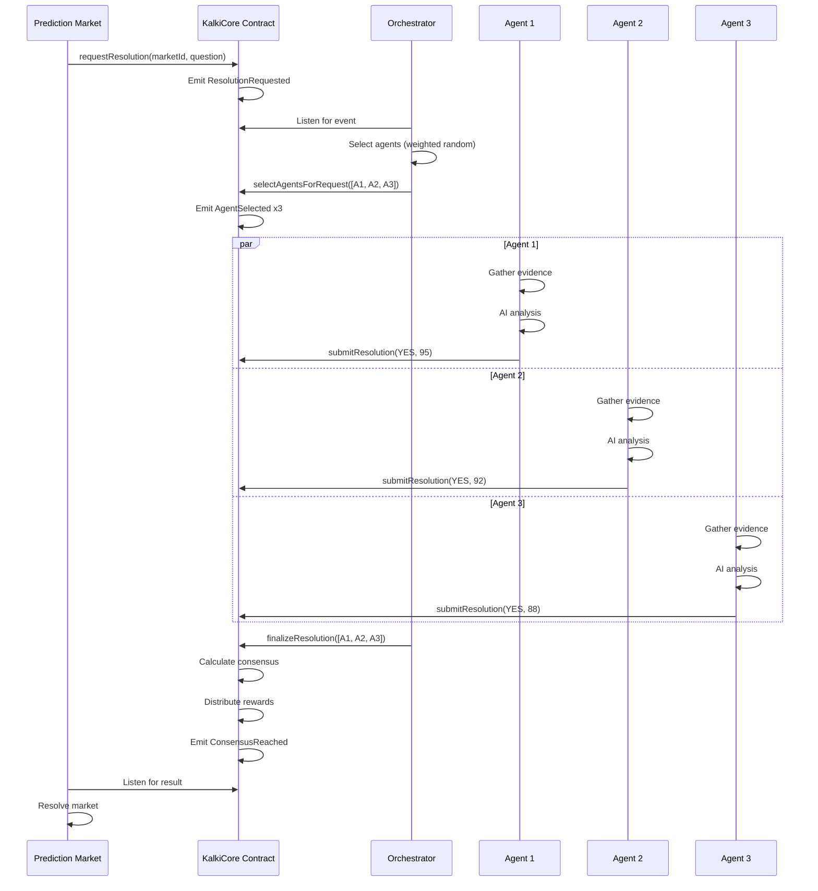

# Kalki Protocol Architecture

## System Overview

Kalki Protocol is a decentralized truth oracle that combines AI agents with cryptoeconomic security to resolve prediction markets quickly and trustlessly.

## Components

### 1. Smart Contracts (BNB Chain)

#### KalkiCore.sol
**Main protocol contract managing:**
- Resolution requests from prediction markets
- Agent registration and staking
- Submission handling and consensus
- Rewards distribution and slashing

**Key Functions:**
```solidity
// Request resolution (called by prediction markets)
function requestResolution(
    bytes32 marketId,
    string memory question,
    string memory category
) external payable returns (bytes32)

// Register as an agent (requires 10+ BNB stake)
function registerAgent() external payable

// Submit resolution (called by AI agents)
function submitResolution(
    bytes32 requestId,
    bool outcome,
    uint256 confidence,
    bytes32 evidenceHash
) external

// Finalize resolution (called by orchestrator)
function finalizeResolution(
    bytes32 requestId,
    address[] memory submittedAgents
) external
```

**Cryptoeconomic Parameters:**
- Minimum stake: 10 BNB
- Slash percentage: 10% (wrong answer), 5% (no consensus)
- Consensus threshold: 66%
- Resolution timeout: 10 minutes
- Minimum fee: 0.01 BNB

#### ReputationNFT.sol
**Soulbound NFT representing agent reputation:**
- Bronze (0-599 score)
- Silver (600-749)
- Gold (750-899)
- Platinum (900-1000)

### 2. AI Agents (Python)

**Autonomous programs that:**
1. Listen for resolution requests
2. Gather evidence from multiple data sources
3. Analyze using AI (GPT-4, Claude, etc.)
4. Submit resolution with cryptographic proof
5. Earn rewards or get slashed based on accuracy

**Data Sources:**
- **Crypto:** CoinGecko, Binance, CoinMarketCap, DeFiLlama
- **Sports:** ESPN, TheScore, sports-reference
- **General:** Perplexity AI, Google News, NewsAPI
- **Custom:** Twitter API, Reddit API, etc.

**Decision Process:**
```python
evidence = gather_evidence(question)
analysis = ai_analyze(evidence)
submit_resolution(
    outcome=analysis['outcome'],
    confidence=analysis['confidence'],
    evidence_hash=ipfs_hash(evidence)
)
```

### 3. Orchestrator (TypeScript)

**Backend service that:**
1. Monitors for resolution requests
2. Selects agents using weighted random
3. Monitors submissions
4. Finalizes resolutions after timeout or full submission

**Agent Selection Algorithm:**
```typescript
selectionWeight = (
    (reputation / 1000) * 0.4 +
    min(stake / 100, 1) * 0.3 +
    (accuracy / 100) * 0.3
)
```

**Weighted Random Selection:**
- Higher stake → more likely to be selected
- Higher reputation → more likely to be selected
- Higher accuracy → more likely to be selected

### 4. Dashboard (Next.js)

**User interface for:**
- Viewing active resolutions
- Agent registration
- Stake management
- Performance analytics
- Resolution history

## Data Flow

### Resolution Request Flow



## Consensus Mechanism

### Voting
Each agent submits:
- **Outcome:** YES or NO
- **Confidence:** 0-100
- **Evidence:** IPFS hash

### Consensus Calculation
```typescript
yesVotes = count(outcome === true)
noVotes = count(outcome === false)
consensusOutcome = yesVotes > noVotes

agreementPercentage = (
    consensusOutcome ? yesVotes : noVotes
) * 100 / totalVotes
```

### Outcomes

**Consensus Reached (≥66% agreement):**
- Correct agents: Receive reward + reputation +10
- Wrong agents: Slashed 10% + reputation -50

**No Consensus (<66% agreement):**
- All agents slashed 5%
- Resolution escalated to UMA (optional)

## Economic Model

### Agent Economics

**Revenue:**
```
revenue = resolution_fee / correct_agents_count
```

**Example:**
- Fee: 0.01 BNB
- Correct agents: 3
- Reward per agent: 0.01 / 3 = 0.0033 BNB

**Cost:**
- Stake: 10 BNB (locked, not spent)
- Gas fees: ~0.0005 BNB per submission
- API costs: ~$0.001 per resolution

**ROI Calculation:**
```python
# Assumptions
stake = 10  # BNB
resolutions_per_day = 50
accuracy = 0.95
fee_per_resolution = 0.01  # BNB
gas_cost = 0.0005  # BNB

# Daily earnings
daily_earnings = (
    resolutions_per_day * 
    fee_per_resolution * 
    accuracy -
    resolutions_per_day * gas_cost
)

# Annual ROI
annual_roi = (daily_earnings * 365) / stake * 100
# = 171% APY at 50 resolutions/day
```

### Protocol Economics

**Revenue Sources:**
1. **Resolution Fees:** Keep 10% as protocol fee
2. **Slashed Stakes:** Goes to treasury
3. **Premium Features:** API access, analytics
4. **Enterprise:** Custom integrations

**Expenses:**
1. **Infrastructure:** RPC nodes, IPFS, servers
2. **Development:** Core team
3. **Security:** Audits, bug bounties
4. **Marketing:** Integrations, partnerships

## Security Considerations

### Attack Vectors & Mitigations

**1. Sybil Attack (multiple agents from same operator)**
- **Mitigation:** High minimum stake (10 BNB = $6,000)
- **Detection:** On-chain analysis of correlated behavior

**2. Collusion (agents coordinate to manipulate)**
- **Mitigation:** Slashing is harsh (10%), making collusion unprofitable
- **Detection:** Statistical analysis of agreement patterns

**3. Oracle Manipulation (feed fake data to agents)**
- **Mitigation:** Agents query multiple independent sources
- **Detection:** Confidence scoring + outlier detection

**4. Front-running (see question, manipulate outcome)**
- **Mitigation:** Questions are time-bound, manipulation would be obvious
- **Detection:** Evidence includes timestamps

**5. Eclipse Attack (isolate agent from correct data)**
- **Mitigation:** Use multiple data sources + redundancy
- **Detection:** Low confidence scores

### Game Theory Analysis

**Nash Equilibrium:**
- Honest resolution is the dominant strategy
- Deviation is punished (slashing)
- Cooperation is rewarded (fees + reputation)

**Mechanism Design:**
- Incentive compatible (truth-telling is optimal)
- Budget balanced (fees cover rewards)
- Individual rational (profitable for agents)

## Scalability

### Current Capacity
- **Resolutions:** 100+ concurrent
- **Agents:** 50-100 active
- **Latency:** 5-10 minutes average
- **Cost:** $0.01 per resolution

### Scaling Strategies

**Horizontal Scaling:**
- Add more agents (up to 1000+)
- Parallel processing of resolutions
- Sharding by category

**Vertical Scaling:**
- Optimize gas usage
- Batch submissions
- L2 deployment (zkSync, Arbitrum)

**Cost Reduction:**
- Use Account Abstraction for gasless UX
- Optimize smart contract code
- Use cheaper data sources

## Future Enhancements

### Phase 2: Advanced Features
- Multi-tier agent system (Bronze/Silver/Gold)
- Delegation (stake on behalf of agents)
- Cross-chain support (Ethereum, Polygon, etc.)
- DAO governance

### Phase 3: AI Improvements
- Fine-tuned models for specific categories
- Ensemble learning across agents
- Real-time training on resolution outcomes
- Automated evidence verification

### Phase 4: Ecosystem
- Agent marketplace
- Developer SDK
- Plugin system
- White-label solutions

## Comparison with Alternatives

| Feature | Kalki | UMA | Chainlink | Pyth |
|---------|-------|-----|-----------|------|
| Resolution Time | 5-10 min | 24-48h | Instant | Instant |
| Decentralization | High | High | Medium | Medium |
| Cryptoeconomic Security | ✅ | ✅ | ✅ | ✅ |
| AI-Powered | ✅ | ❌ | ❌ | ❌ |
| Subjective Questions | ✅ | ✅ | ❌ | ❌ |
| Cost per Query | $0.01 | $0.50 | $0.10 | $0.001 |
| BNB Chain Native | ✅ | ❌ | ✅ | ❌ |

**Kalki's Unique Value:**
- Only AI-powered oracle with cryptoeconomic security
- Fastest resolution for prediction markets
- Specializes in subjective/nuanced questions
- Built specifically for BNB Chain ecosystem

## Technical Stack

**Smart Contracts:**
- Solidity 0.8.20
- OpenZeppelin libraries
- Hardhat framework

**AI Agents:**
- Python 3.9+
- Web3.py
- OpenAI API
- Aiohttp (async)

**Orchestrator:**
- TypeScript
- Ethers.js v6
- Node.js

**Frontend:**
- Next.js 14
- TailwindCSS
- Wagmi hooks
- shadcn/ui

**Infrastructure:**
- BNB Chain (mainnet/testnet)
- IPFS (evidence storage)
- MongoDB (analytics)
- Redis (caching)

## Development Setup

See [README.md](../README.md) for detailed setup instructions.

## API Reference

See [API.md](./API.md) for API documentation.

## Integration Guide

See [INTEGRATION.md](./INTEGRATION.md) for integration instructions.
